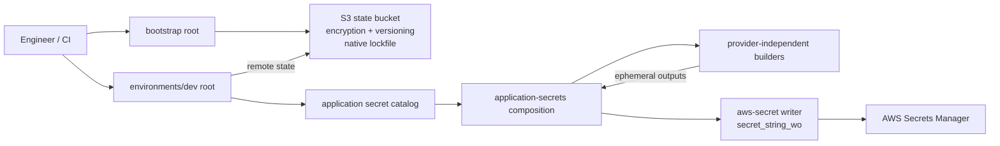

# Secure AWS Secrets Provisioning with Terraform

A reusable Terraform design for provisioning application secrets with generated
values without writing those values to Terraform state or saved plans.

The project models a common platform-engineering task: an application needs
many AWS Secrets Manager secrets, the secrets have several known formats, and
operators should not have to populate every value manually in every
environment.

The implementation uses:

- Terraform ephemeral resources for generation;
- AWS Secrets Manager's write-only `secret_string_wo` argument;
- a non-secret `value_version` counter for intentional rotation;
- small builders for concrete secret formats;
- collections, so adding another secret of an existing format is one catalog
  entry.

## Architecture



The editable diagram is in [docs/architecture.mmd](docs/architecture.mmd).

## Repository layout

```text
bootstrap/                         # Independent root for the S3 backend
environments/dev/                 # Independent root declaring dev secrets
modules/
  aws-secret/                      # Low-level AWS Secrets Manager writer
  application-secrets/             # AWS composition and application-facing API
  builders/
    hex-token/                     # Hex shared keys and API tokens
    username-password/             # { username, password }
    client-credentials/            # Client ID, generated secret, environment
    plain-password/                # Password stored as a raw string
    tls-private-key/               # Ephemeral ECDSA private key document
    multi-user-document/           # Base64 JSON with users and bcrypt hashes
scripts/                           # Static and AWS lifecycle verification
docs/                              # Architecture notes
```

## The important abstraction

### `modules/aws-secret`

The low-level module owns the two AWS resources:

```hcl
resource "aws_secretsmanager_secret" "this" {
  # name, description, tags
}

resource "aws_secretsmanager_secret_version" "current" {
  secret_string_wo         = var.secret_value
  secret_string_wo_version = var.value_version
}
```

Its `secret_value` variable is ephemeral. The module treats it as an opaque
string and has no knowledge of JSON fields, Base64, passwords, hashes, or key
formats. This is the only low-level module coupled to AWS Secrets Manager.

### Format builders

A builder owns the readable Terraform code for one concrete format. It
generates ephemeral values, performs required transformations, and exposes a
`sensitive = true`, `ephemeral = true` output. It does not create a cloud secret
and does not know about AWS names, tags, descriptions, or rotation counters.

For example, a builder exposes its generated map only through an ephemeral
child-module output:

```hcl
output "values" {
  value     = local.secret_values
  sensitive = true
  ephemeral = true
}
```

Each builder accepts a map and generates every entry with `for_each`. A new
secret of an existing format therefore does not require another module
directory or module call.

Provider boundaries are explicit:

| Module | Provider dependency |
|---|---|
| Password/token/document builders | `hashicorp/random` only |
| TLS private-key builder | `hashicorp/tls` only |
| `aws-secret` writer | `hashicorp/aws` only |
| `application-secrets` | Composition layer wiring builders to the AWS writer |

The same builders can therefore feed a future GCP Secret Manager or Vault
writer without modification.

For example, two shared keys are just two entries:

```hcl
hex_tokens = {
  "shared-key" = {
    description = "Shared key for service authentication"
  }

  "webhook-token" = {
    description = "Token used to authenticate webhook requests"
  }
}
```

The default token is 64 lowercase hexadecimal characters, equivalent in shape
to `openssl rand -hex 32`.

### Application catalog

[`environments/dev/main.tf`](environments/dev/main.tf) is the part a platform
engineer normally edits. It calls `modules/application-secrets` once and groups
the required secrets by format:

```hcl
module "application_secrets" {
  source = "../../modules/application-secrets"

  application_name = var.application_name
  environment      = var.environment

  hex_tokens = {
    "shared-key" = {
      description = "256-bit service shared key"
    }
  }

  username_passwords = {
    "database-credentials" = {
      description = "Database credentials"
      username    = "application-user"
    }
  }
}
```

If a completely new structure is required, add a focused builder containing
normal Terraform expressions. The project deliberately does not implement a
generic transformation language.

`application-secrets` is the AWS-specific composition layer: it invokes the
pure builders, receives their ephemeral outputs, and passes those outputs to
`aws-secret` together with AWS metadata and `value_version`.

## Included formats

| Builder | Stored value |
|---|---|
| `hex-token` | Lowercase hexadecimal token |
| `username-password` | JSON with fixed username and generated password |
| `client-credentials` | JSON with client ID, generated secret, and environment |
| `plain-password` | Generated password as a raw string |
| `tls-private-key` | JSON with ephemeral ECDSA P-384 private and public keys |
| `multi-user-document` | Base64-encoded JSON containing usernames and bcrypt hashes |

Base64 is not treated as security and is not a standalone secret type. It is a
transformation inside `multi-user-document` because that example's consumer is
assumed to require a Base64 document.

The password builders use the Random provider's standard special-character
set. There is no unexplained `override_special`. If a real consumer imposes a
restricted character policy, that constraint should be added explicitly to
that builder's input and documented there.

## Why ordinary generated resources are a risk

A managed `random_password` resource keeps its generated result stable by
storing it in Terraform state. Marking a value `sensitive` hides normal CLI
display but does not remove it from state or plan data.

Ephemeral resources behave differently: their generated results are available
only during the Terraform operation. Derived values produced with functions
such as `jsonencode`, `base64encode`, and `sha512` retain ephemerality.

The write-only `secret_string_wo` argument is the terminal destination. The AWS
provider sends the value to Secrets Manager, while Terraform stores `null`
instead of the value.

## Rotation lifecycle

Every secret omitted from `value_versions` starts with effective
`value_version = 1`.

```hcl
value_versions = {}
```

To rotate one secret, persist a higher counter in
`environments/dev/terraform.tfvars`:

```hcl
value_versions = {
  "service-password" = 2
}
```

Rules:

- repeated applies with the same counter do not write another AWS version;
- tag or description changes do not rotate the value;
- increasing the counter writes one new Secrets Manager version;
- rotation does not replace the `aws_secretsmanager_secret` resource;
- counters must never be decreased or reused.

The ephemeral generator may run transiently during planning, but Secrets
Manager receives a new value only when the durable version counter changes.

## Bootstrap the backend

Bootstrap is an independent Terraform root. It creates an S3 bucket with
versioning, SSE-S3 encryption, all public-access blocks, bucket-owner-enforced
ownership, a TLS-only policy, and deletion protection.

Set the `AWS_REGION` and `TF_STATE_BUCKET` repository variables, then run
**Actions → Bootstrap Terraform backend → Run workflow** once. The workflow
creates the bucket and stores its own state at
`bootstrap/terraform.tfstate` inside that bucket.

Native S3 state locking is enabled with `use_lockfile = true`; no DynamoDB table
is required.

## Deploy the application secrets

Copy the safe bootstrap outputs into the untracked backend configuration and
choose the real application name in `terraform.tfvars`:

```bash
cp environments/dev/backend.hcl.example environments/dev/backend.hcl
cp environments/dev/terraform.tfvars.example environments/dev/terraform.tfvars

terraform -chdir=environments/dev init -backend-config=backend.hcl
terraform -chdir=environments/dev plan -out=secrets.tfplan
terraform -chdir=environments/dev apply secrets.tfplan
terraform -chdir=environments/dev output -json secrets
```

Outputs contain only safe metadata: secret name, ARN, AWS version ID, and the
non-secret rotation counter.

## GitHub Actions deployment

The S3 backend must exist before the pull-request plan and deployment workflows
can run. Create it once using the bootstrap workflow above.

In the GitHub repository, open **Settings → Secrets and variables → Actions**
and configure the following repository secrets:

| Repository secret | Value |
|---|---|
| `AWS_ACCESS_KEY_ID` | Access key ID for the Terraform IAM principal |
| `AWS_SECRET_ACCESS_KEY` | Corresponding secret access key |

Configure these repository variables in the same section:

| Repository variable | Example |
|---|---|
| `AWS_REGION` | `eu-central-1` |
| `TF_STATE_BUCKET` | Globally unique bucket name chosen before bootstrap |
| `TF_STATE_KEY` | `secure-aws-secrets-provisioning/dev/terraform.tfstate` |
| `APPLICATION_NAME` | `orders-api` |

The IAM principal needs access to the configured S3 state object and its
`.tflock` file, plus permissions to create, describe, tag, update, and delete
the application's Secrets Manager secrets. Use a dedicated least-privilege IAM
principal rather than a personal administrator key.

Create a GitHub Environment named `dev`. For a portfolio or production-like
setup, configure a required reviewer on that environment. The apply job cannot
start until the environment approval is granted.

Three workflows are included:

- [bootstrap.yml](.github/workflows/bootstrap.yml) is a one-time manual workflow
  that creates the S3 backend before application planning or deployment.
- [pull-request.yml](.github/workflows/pull-request.yml) always runs formatting,
  offline initialization, validation, and repository checks. For pull requests
  from this repository, it also authenticates to AWS, initializes the real S3
  backend, and runs `terraform plan -detailed-exitcode`. Exit code `2` means
  configuration changes or infrastructure drift were detected and is reported
  without failing the workflow. Fork and Dependabot pull requests do not
  receive AWS credentials and skip the cloud plan.
- [deploy.yml](.github/workflows/deploy.yml) runs after changes reach `main`, or
  through manual `workflow_dispatch`. It initializes the S3 backend, validates,
  creates a fresh saved plan, and applies that exact plan in the protected
  `dev` environment.

The PR plan is intentionally not uploaded and reused by deployment. The deploy
job creates a new plan against the latest main revision and current remote
state immediately before apply.

## Automated verification

After initializing the dev root against its backend:

```bash
./scripts/verify-lifecycle.sh
```

The test uses an isolated Terraform workspace and uniquely named secrets. It
verifies without printing values that:

1. all declared secrets contain non-empty values;
2. live values are absent from pulled state;
3. live values and populated write-only fields are absent from saved plans;
4. a second apply retains every AWS `AWSCURRENT` version ID;
5. a tag-only apply retains every version ID;
6. increasing `service-password` from version 1 to 2 adds exactly one version;
7. the AWS secret name and ARN remain unchanged during rotation.

Secret contents exist only in verifier process memory for byte-comparison. The
script disables Terraform trace logging and never writes or prints those
values. Test resources are destroyed afterward; AWS retains deleted secrets for
the configured seven-day recovery window.

## Local and CI checks

```bash
terraform fmt -check -recursive
terraform -chdir=bootstrap init -backend=false
terraform -chdir=bootstrap validate
terraform -chdir=environments/dev init -backend=false
terraform -chdir=environments/dev validate
./scripts/check-no-persistent-secrets.sh
```

`make check` runs the same static checks locally. GitHub Actions uses current
major releases of the official actions: `actions/checkout@v6`,
`hashicorp/setup-terraform@v4`, and
`aws-actions/configure-aws-credentials@v6.1.2`.

## Security boundaries

- Ephemeral values still exist briefly in Terraform and provider process
  memory. Protect the execution host and do not enable trace logging.
- Protect the S3 backend with least-privilege IAM even though generated values
  are absent from state.
- Consumers should retrieve secrets at runtime using scoped IAM roles.
- The bcrypt multi-user example is appropriate only when the consumer needs
  verification hashes. The generated plaintext passwords are intentionally
  unavailable after apply.
- Scheduled/automatic rotation is outside this project.

## References

- [Terraform ephemeral blocks](https://developer.hashicorp.com/terraform/language/block/ephemeral)
- [Terraform write-only arguments](https://developer.hashicorp.com/terraform/language/manage-sensitive-data/write-only)
- [AWS Secrets Manager secret versions](https://registry.terraform.io/providers/hashicorp/aws/latest/docs/resources/secretsmanager_secret_version)
- [Random password ephemeral resource](https://registry.terraform.io/providers/hashicorp/random/latest/docs/ephemeral-resources/password)
- [TLS private key ephemeral resource](https://registry.terraform.io/providers/hashicorp/tls/latest/docs/ephemeral-resources/private_key)
- [AWS native S3 state locking guidance](https://docs.aws.amazon.com/prescriptive-guidance/latest/terraform-aws-provider-best-practices/backend.html)
