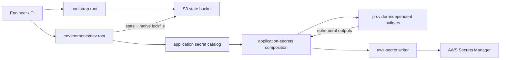

# Architecture

## Responsibilities

- `bootstrap` owns only the remote-state S3 bucket.
- `environments/dev` declares which secrets an application needs.
- `application-secrets` applies common naming, tags, and version defaults and
  connects generated payloads to the AWS writer.
- Each provider-independent builder owns one concrete value format, creates
  multiple values with `for_each`, and returns only ephemeral outputs.
- `aws-secret` owns Secrets Manager metadata and the write-only value operation.
  It deliberately cannot inspect or depend on the payload's internal structure.

This separation allows the same builders to feed a future GCP, Vault, or other
cloud-specific writer without modification.
